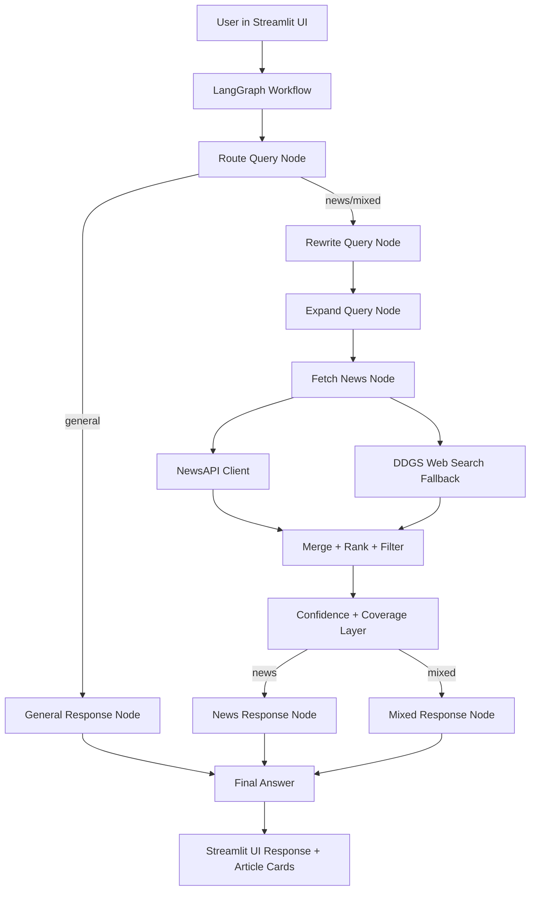
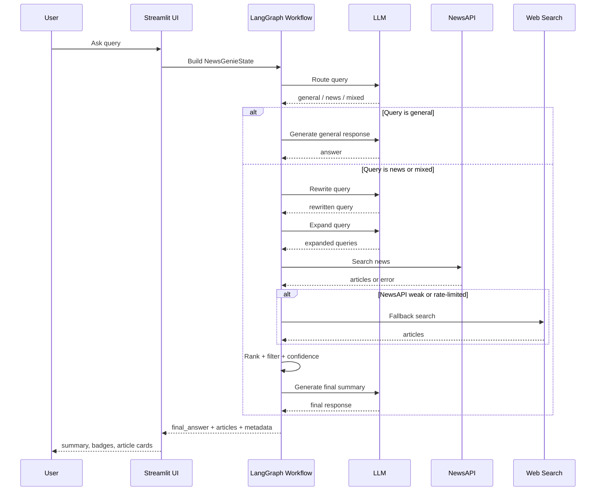
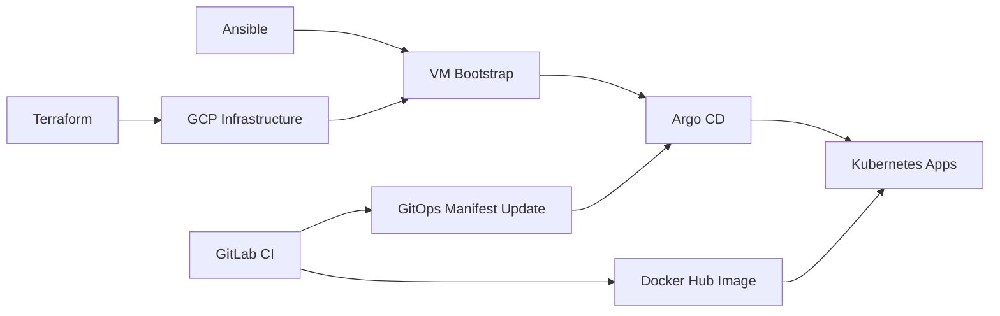
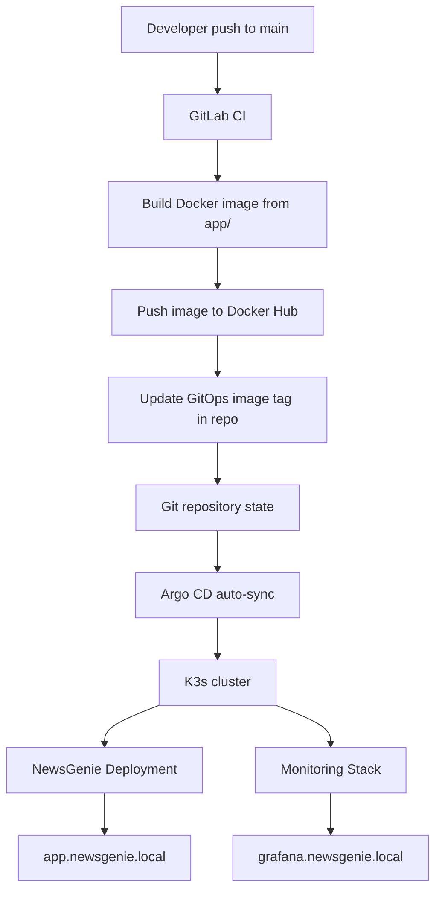
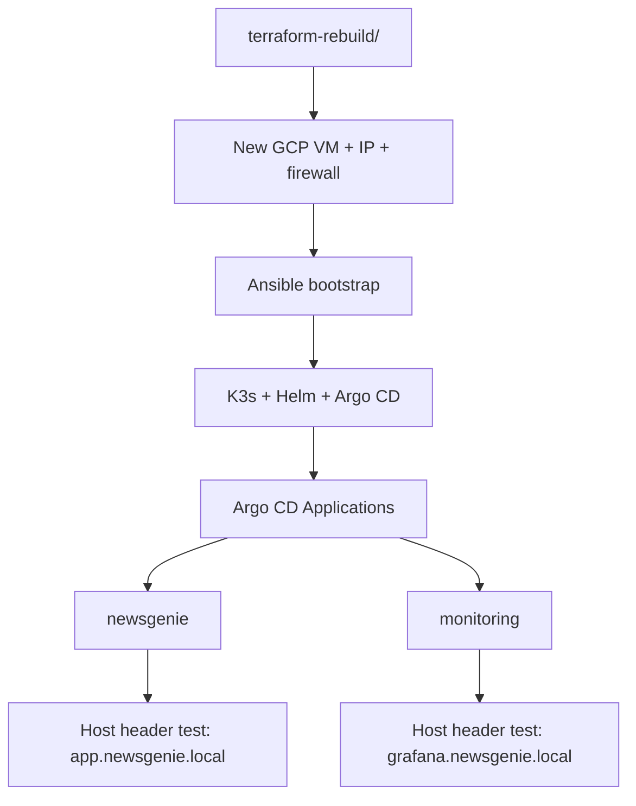

# NewsGenie

NewsGenie is an **Agentic AI news assistant** built with **Streamlit**, **LangGraph**, **OpenAI/Gemini**, **NewsAPI**, and **web-search fallback**.

It can:
- answer general questions
- fetch and summarize the latest news
- handle mixed questions that need both explanation and live news
- rewrite vague follow-up queries using conversation context
- expand and rank searches across multiple retrieval paths
- apply entity, region, and timeframe-aware filtering
- generate confidence-aware summaries with coverage notes
- gracefully fall back when NewsAPI is rate-limited or unavailable

---

# Part 1 — NewsGenie Application Architecture

## 1. Key Features

### Core capabilities
- **General Q&A** for non-news questions
- **Live news retrieval** for current events and headlines
- **Mixed-query support** for prompts like:
  `Explain inflation and also give me today's finance news`

### Agentic workflow
- **Routing** into `general`, `news`, or `mixed`
- **Memory-aware follow-up handling** for prompts like:
  `what about in Europe?`
  `and in the US?`
  `give me more on Arsenal`
- **Query rewriting** to convert vague prompts into standalone search queries
- **Query expansion** to generate multiple search-friendly variants
- **Entity locking** for topics like `OpenAI`, `Arsenal`, `S&P 500`, `Nasdaq`
- **Timeframe detection** for `today`, `latest`, `this week`
- **Region-aware retrieval** for `US`, `Europe`, `India`, `Asia`

### Quality and trust
- **Confidence labels**: Low / Medium / High
- **Coverage notes** explaining whether the result set is broad or limited
- **Source-aware ranking and filtering**
- **Fallback behavior** when NewsAPI rate-limits or returns weak results

### UI
- Polished **Streamlit chat interface**
- **Article cards** with source, time, score, and links
- **Badges** for category, confidence, and timeframe
- **Debug panel** for rewritten query, expansions, entities, and coverage note

---

## 2. Architecture Overview

### High-level architecture diagram



---

## 3. Detailed Architecture Explanation

### 3.1 Streamlit UI Layer
The `app.py` file provides the user-facing interface.

Responsibilities:
- collect user queries through chat input
- maintain session chat history
- send state into the LangGraph workflow
- render summaries, badges, and article cards
- show optional debug information

### 3.2 LangGraph Orchestration Layer
The heart of the app is the **LangGraph state machine** in `src/graph/workflow.py`.

It manages the multi-step agentic flow:
1. **Route query**
2. **Rewrite query** if needed
3. **Expand search queries**
4. **Fetch and merge articles**
5. **Compute confidence and coverage**
6. **Generate final response**

This makes the system modular and easy to extend.

### 3.3 Routing Agent
The routing node decides whether a user query is:
- `general`
- `news`
- `mixed`

Examples:
- `Who is the CEO of Microsoft?` → `general`
- `latest AI news` → `news`
- `Explain inflation and also give me today's finance news` → `mixed`

### 3.4 Query Rewrite Agent
The rewrite node makes vague user prompts more retrieval-friendly.

Examples:
- `what about in Europe?` → `latest AI news in Europe`
- `and in the US?` → `today's US stock market news`
- `give me more on Arsenal` → `Arsenal latest Champions League news`

### 3.5 Query Expansion Agent
This node generates multiple search variations to improve recall.

Example expansions:
- original query
- rewritten standalone query
- narrow entity-specific query
- category-aware query

This improves retrieval diversity without changing user intent.

### 3.6 Retrieval Layer
The retrieval layer uses two sources:

#### Primary source: NewsAPI
Used first for:
- `everything`
- `top-headlines`

#### Fallback source: DDGS web search
Used when:
- NewsAPI is rate-limited
- NewsAPI fails
- NewsAPI returns weak coverage

### 3.7 Ranking and Filtering Layer
After retrieval, all results go through:
- de-duplication
- source normalization
- trust scoring
- region filtering
- entity locking
- timeframe-aware recency scoring
- competition and index matching
- noise filtering

This is where the system decides whether an article is truly relevant.

### 3.8 Confidence and Coverage Layer
After ranking, NewsGenie computes:
- **confidence score**
- **confidence label**
- **coverage note**

This ensures the assistant stays honest.

Examples:
- **High confidence** when several strong relevant articles are found
- **Low confidence** when only 1 weak or sparse article is found

### 3.9 Response Generation Layer
The final LLM response is generated differently based on query type:

#### General
Normal assistant response

#### News
Summary + key developments + watchouts

#### Mixed
General answer + latest news + key developments + watchouts

---

## 4. Workflow Diagram with Steps



---

## 5. Project Structure

```text
newsgenie/
├── app.py
├── README.md
├── requirements.txt
├── requirements-lock.txt
├── .env.example
├── src/
│   ├── config.py
│   ├── prompts.py
│   ├── state.py
│   ├── graph/
│   │   └── workflow.py
│   ├── models/
│   │   ├── openai_client.py
│   │   └── gemini_client.py
│   ├── tools/
│   │   ├── news_api.py
│   │   └── web_search.py
│   └── utils/
│       ├── helpers.py
│       ├── common.py
│       ├── news_helpers.py
│       ├── answer_quality.py
│       └── ui_helpers.py
└── tests/
    ├── smoke_test.py
    ├── test_routing.py
    ├── test_news_fetch.py
    ├── test_ranked_news.py
    ├── test_query_rewrite.py
    ├── test_dual_search.py
    ├── test_step7_filters.py
    ├── test_step8_quality.py
    ├── test_step9_precision.py
    ├── test_step10_entity_lock.py
    └── test_step11_resilience.py
```

---

## 6. Tech Stack

- **Python**
- **Streamlit**
- **LangGraph**
- **OpenAI Responses API**
- **Google Gemini**
- **NewsAPI**
- **DDGS** for fallback search
- **Pydantic** for state modeling
- **Requests** for API access

---

## 7. Setup Instructions

### 7.1 Create virtual environment

```bash
python -m venv newsginni
source newsginni/bin/activate
```

### 7.2 Install dependencies

```bash
pip install -r requirements.txt
```

### 7.3 Configure environment

Copy `.env.example` to `.env`.

```bash
cp .env.example .env
```

Example `.env`:

```env
OPENAI_API_KEY=your_openai_api_key_here
MODEL_PROVIDER=openai
OPENAI_MODEL=gpt-5-mini

GEMINI_API_KEY=your_gemini_api_key_here
NEWS_API_KEY=your_newsapi_key_here

APP_ENV=dev
DEBUG=false
```

---

## 8. How to Run

### Start Streamlit app

```bash
streamlit run app.py
```

### Run core tests

```bash
python -m tests.smoke_test
python -m tests.test_routing
python -m tests.test_news_fetch
python -m tests.test_step10_entity_lock
python -m tests.test_step11_resilience
```

---

## 9. Example Queries

### General queries
- `Who is the CEO of Microsoft?`
- `Explain inflation`

### News queries
- `latest AI news in Europe`
- `today's S&P 500 and Nasdaq news`
- `latest Arsenal Champions League news`

### Mixed queries
- `Explain inflation and also give me today's finance news`

### Follow-up queries
- `what about in Europe?`
- `and in the US?`
- `give me more on Arsenal`

---

## 10. Final Validation Checklist

### Core functionality
- [x] App starts successfully
- [x] OpenAI integration works
- [x] Streamlit UI works
- [x] LangGraph workflow runs end to end
- [x] Router classifies `general`, `news`, `mixed`
- [x] Query rewrite works
- [x] Query expansion works
- [x] Retrieval works
- [x] Ranking/filtering works
- [x] Confidence and coverage notes work
- [x] NewsAPI fallback to web search works
- [x] Entity/timeframe logic works
- [x] UI shows badges/cards/debug details

### Robustness
- [x] Safer JSON parsing
- [x] Retry logic exists
- [x] Rate-limit fallback works
- [x] Empty/weak coverage handled honestly

### Known acceptable limitations
- [x] NewsAPI free-tier rate limits can occur
- [x] Fallback search quality depends on public web results
- [x] Some niche entity + region combinations may have limited coverage

---

## 11. Known Limitations

- **NewsAPI free tier** can hit rate limits quickly during repeated test runs.
- **Public search fallback** depends on the quality and freshness of search engine results.
- Some combinations like **entity + region + timeframe** may still yield sparse coverage.
- Confidence depends on:
  - article availability
  - source quality
  - relevance of retrieved articles

---

## 12. Submission / Demo Status

NewsGenie is now a **demo-ready advanced prototype** with:
- agentic orchestration
- robust retrieval fallback
- confidence-aware summarization
- entity / region / timeframe-aware filtering
- polished Streamlit UI

### Current completion status
- **Core implementation:** complete
- **Robustness:** good
- **UI polish:** complete for demo
- **Packaging:** complete with README and `.env.example`

---

## 13. Future Improvements

Optional future enhancements:
- response caching to reduce repeated API calls
- export chat / save summaries
- region selector in UI
- persistent chat memory/database
- Docker deployment
- Streamlit Cloud / Render deployment
- analytics and evaluation dashboard

---

## 14. Quick Pitch

**NewsGenie** is an agentic AI news assistant that understands vague follow-up questions, rewrites them into precise retrieval queries, gathers live coverage from multiple sources, filters and ranks results by relevance, and returns confidence-aware summaries in a polished Streamlit interface.

---

# Part 2 — CI/CD, GitOps, and Platform Operations

## 15. NewsGenie CI/CD and GitOps

NewsGenie is deployed on Kubernetes with a GitOps workflow.

This repository now follows a clear target-state ownership model:

- **Terraform**: cloud infrastructure
- **Ansible**: machine bootstrap
- **Argo CD**: Kubernetes platform apps and business apps
- **GitLab CI**: build artifacts and update GitOps metadata

> The previous README described an older deployment model where GitLab built the image and then deployed directly to the VM with Ansible. The current platform has moved to a GitOps model driven by Argo CD.

---

## 16. Table of Contents

1. [Project Overview](#project-overview)
2. [Current Target State](#current-target-state)
3. [Architecture Diagrams](#architecture-diagrams)
4. [Repository Structure](#repository-structure)
5. [Tech Stack](#tech-stack)
6. [Environment Variables and Secrets](#environment-variables-and-secrets)
7. [Run Locally](#run-locally)
8. [Run with Docker](#run-with-docker)
9. [Deployment Flow](#deployment-flow)
10. [GitLab CI/CD Pipeline](#gitlab-cicd-pipeline)
11. [Argo CD Applications](#argo-cd-applications)
12. [Terraform](#terraform)
13. [Ansible Bootstrap](#ansible-bootstrap)
14. [Monitoring](#monitoring)
15. [Fresh Rebuild Workflow](#fresh-rebuild-workflow)
16. [Destroy the Rebuild Environment](#destroy-the-rebuild-environment)
17. [Verification Checklist](#verification-checklist)
18. [Troubleshooting](#troubleshooting)
19. [Security Notes](#security-notes)

---

## 17. Project Overview

NewsGenie is built as an agentic AI application for news workflows. Instead of sending every user query directly to a model in one step, the app uses a structured workflow to classify, rewrite, expand, retrieve, filter, and synthesize results before generating the final response.

Main entry point:

- `app/app.py`

Typical workflow:

1. user submits a query in Streamlit
2. workflow classifies and routes the query
3. query may be rewritten and expanded
4. retrieval tools fetch news/web results
5. content is filtered, scored, and synthesized
6. the final answer is generated and shown in the UI

---

## 18. Current Target State

### 18.1 Terraform owns cloud infrastructure

Terraform manages the baseline GCP resources for the live environment:

- VPC network
- firewall rules
- VM instance
- static external IP
- remote Terraform state in GCS

A separate Terraform root is used for **parallel rebuilds** so the rebuild VM can be created and destroyed without touching the live environment.

### 18.2 Ansible owns machine bootstrap

Ansible bootstraps a VM into a working platform host by configuring:

- base packages
- K3s
- Helm
- kubeconfig access for the target user
- Argo CD install
- bootstrap secrets
- Argo CD application registration

The bootstrap playbook is idempotent.

### 18.3 Argo CD owns Kubernetes apps

Argo CD manages:

- `newsgenie` application
- `monitoring` application
- NEWSGenie ingress
- Grafana ingress
- monitoring stack adoption

### 18.4 GitLab CI owns app build and GitOps metadata updates

GitLab CI:

- builds the NewsGenie Docker image
- pushes it to Docker Hub
- updates the image tag in Git-tracked GitOps manifests
- lets Argo CD sync the change into Kubernetes

GitLab CI is intentionally limited so **infra-only commits do not trigger image build/deploy jobs**.

---

## 19. Architecture Diagrams

### Ownership Model



### End-to-End Deployment Flow



### Fresh Rebuild Flow



---

## 20. Repository Structure

High-level structure:

```text
newsgenie-cicd/
├── app/
│   ├── Dockerfile
│   ├── app.py
│   ├── requirements.txt
│   └── src/
├── ansible/
│   ├── ansible.cfg
│   ├── bootstrap.yml
│   ├── inventory/
│   │   └── hosts.yml
│   ├── group_vars/
│   │   └── newsgenie_hosts.yml
│   ├── roles/
│   │   ├── base/
│   │   ├── k3s/
│   │   ├── helm/
│   │   ├── argocd/
│   │   ├── argocd_apps/
│   │   └── bootstrap_secrets/
│   └── secrets/
├── gitops/
│   ├── argocd/
│   │   ├── newsgenie-application.yaml
│   │   └── monitoring-application.yaml
│   ├── newsgenie/
│   │   ├── namespace.yaml
│   │   ├── deployment.yaml
│   │   ├── service.yaml
│   │   ├── ingress.yaml
│   │   └── kustomization.yaml
│   └── monitoring/
│       ├── ingress-grafana.yaml
│       ├── kube-prometheus-stack-values.yaml
│       └── kustomization.yaml
├── terraform/
│   ├── providers.tf
│   ├── variables.tf
│   ├── main.tf
│   └── outputs.tf
├── terraform-rebuild/
│   ├── providers.tf
│   ├── variables.tf
│   ├── main.tf
│   ├── outputs.tf
│   └── rebuild.tfvars.example
├── .gitlab-ci.yml
├── .env.example
└── README.md
```

---

## 21. Tech Stack

### Application

- Python
- Streamlit
- OpenAI client integration
- news/web retrieval tools

### Platform and Delivery

- Docker
- GitLab CI/CD
- Docker Hub
- K3s
- Argo CD
- Prometheus + Grafana
- Ansible
- Terraform
- GCP Compute Engine

---

## 22. Environment Variables and Secrets

### Local app `.env`

Typical variables:

```env
OPENAI_API_KEY=your_real_openai_api_key
NEWS_API_KEY=your_real_news_api_key
APP_ENV=development
PORT=8501
```

### Kubernetes secret for NewsGenie

The Kubernetes secret used by the NewsGenie deployment is named:

- `newsgenie-env`

It is bootstrapped by Ansible from a vaulted file, not from plain Git values.

### Ansible Vault

Sensitive bootstrap values are stored in an encrypted vault file under `ansible/secrets/`.

Commit the **encrypted vault file** if needed.
Do **not** commit the vault password.

---

## 23. Run Locally

```bash
git clone https://github.com/akramsiddiqui2007/newsgenie-cicd.git
cd newsgenie-cicd
python3 -m venv .venv
source .venv/bin/activate
pip install --upgrade pip
pip install -r app/requirements.txt
cp .env.example .env
streamlit run app/app.py
```

Open:

```text
http://localhost:8501
```

---

## 24. Run with Docker

```bash
docker build -t newsgenie:latest ./app
docker run --rm --env-file .env -p 8501:8501 newsgenie:latest
```

Open:

```text
http://localhost:8501
```

---

## 25. Deployment Flow

### Application delivery

1. push app code to `main`
2. GitLab builds and pushes image to Docker Hub
3. GitLab updates `gitops/newsgenie/kustomization.yaml`
4. GitHub/Git repo reflects the new image tag
5. Argo CD auto-syncs the change
6. K3s rolls out the new container image

### Platform bootstrap

1. Terraform provisions VM, firewall, and IP
2. Ansible bootstraps K3s, Helm, Argo CD, secrets, and Argo CD apps
3. Argo CD syncs NewsGenie and monitoring
4. Traefik serves the app and Grafana via ingress

---

## 26. GitLab CI/CD Pipeline

Pipeline file:

- `.gitlab-ci.yml`

### Stages

- `build`
- `deploy`

### Current pipeline behavior

#### `build_and_push_image`
Runs only when files under `app/**/*` change on `main`.

What it does:

- logs in to Docker Hub
- builds image from `./app`
- tags image with:
  - `CI_COMMIT_SHORT_SHA`
  - `latest`
- pushes both tags

#### `update_gitops_image_tag`
Runs only when files under `app/**/*` change on `main`.

What it does:

- updates `gitops/newsgenie/kustomization.yaml`
- sets `newTag: $CI_COMMIT_SHORT_SHA`
- commits with `[skip ci]`
- pushes the GitOps manifest change to GitHub

### Required GitLab variables

Configure in **GitLab → Settings → CI/CD → Variables**:

- `DOCKERHUB_USERNAME`
- `DOCKERHUB_TOKEN`
- `IMAGE_NAME`
- `GITHUB_TOKEN`

### Important pipeline design note

Infra-only commits should not rebuild the application image.
Only app code changes under `app/` trigger the image pipeline.

---

## 27. Argo CD Applications

### `newsgenie`
Manages:

- namespace
- deployment
- service
- ingress
- Kustomize image tag from Git

### `monitoring`
Manages:

- `kube-prometheus-stack` Helm chart
- Grafana ingress
- values file from Git
- diff rules for Grafana checksum drift
- server-side apply for large CRDs

Both apps are expected to show:

- `Synced`
- `Healthy`

Check with:

```bash
kubectl -n argocd get applications.argoproj.io
```

---

## 28. Terraform

### Live environment root

Folder:

- `terraform/`

This manages the current live environment baseline:

- `newsgenie-vpc`
- live VM
- live static IP
- live firewall rules

### Rebuild environment root

Folder:

- `terraform-rebuild/`

This uses a **separate backend prefix** and creates a parallel rebuild environment without touching the live stack.

### Remote state

Terraform state is stored in GCS backend.

### Common commands

#### Live environment

```bash
cd terraform
terraform init
terraform plan
```

#### Rebuild environment

```bash
cd terraform-rebuild
terraform init
terraform plan -var-file=rebuild.tfvars
```

---

## 29. Ansible Bootstrap

Main playbook:

- `ansible/bootstrap.yml`

Roles:

- `base`
- `k3s`
- `helm`
- `argocd`
- `bootstrap_secrets`
- `argocd_apps`

### What bootstrap does

- installs base packages
- installs K3s if missing
- installs Helm if missing
- installs Argo CD if missing
- configures `/home/akram/.kube/config`
- bootstraps NewsGenie secret from vault
- applies Argo CD application manifests

### Run bootstrap

```bash
cd ansible
ansible-playbook -e target_host=<VM_IP> --ask-vault-pass bootstrap.yml
```

### Expected result

A second run should be idempotent with `changed=0`.

---

## 30. Monitoring

Monitoring stack uses:

- `kube-prometheus-stack`
- Grafana
- Prometheus
- kube-state-metrics
- node-exporter

Grafana ingress host:

- `grafana.newsgenie.local`

NewsGenie app ingress host:

- `app.newsgenie.local`

Quick checks:

```bash
kubectl -n monitoring get pods
kubectl -n monitoring get ingress
kubectl -n argocd get applications.argoproj.io
```

---

## 31. Fresh Rebuild Workflow

### 1. Provision a parallel VM

```bash
cd terraform-rebuild
cp rebuild.tfvars.example rebuild.tfvars
terraform init
terraform apply -var-file=rebuild.tfvars
```

### 2. Bootstrap the new VM

```bash
cd ../ansible
ansible-playbook -e target_host=<REBUILD_IP> --ask-vault-pass bootstrap.yml
```

### 3. Verify on the rebuild VM

```bash
ansible newsgenie_hosts -e target_host=<REBUILD_IP> -b -m shell -a 'sudo -u akram env KUBECONFIG=/home/akram/.kube/config kubectl -n argocd get applications.argoproj.io'
```

### 4. Host header tests from laptop

```bash
curl -I -H 'Host: app.newsgenie.local' http://<REBUILD_IP>
curl -I -H 'Host: grafana.newsgenie.local' http://<REBUILD_IP>
```

---

## 32. Destroy the Rebuild Environment

To destroy only the **parallel rebuild VM** and keep the live environment untouched:

```bash
cd terraform-rebuild
terraform destroy -var-file=rebuild.tfvars
```

This destroys only resources tracked by the **rebuild** Terraform state, such as:

- rebuild VM
- rebuild static IP
- rebuild firewall rules

It does **not** affect the live stack in `terraform/`.

---

## 33. Verification Checklist

### Live cluster

```bash
kubectl -n argocd get applications.argoproj.io
kubectl -n newsgenie get ingress
kubectl -n monitoring get ingress
```

### App

```bash
curl -I http://app.newsgenie.local
```

### Grafana

```bash
curl -I http://grafana.newsgenie.local
```

### Terraform

```bash
cd terraform
terraform plan
```

Expected:

```text
No changes. Your infrastructure matches the configuration.
```

### Ansible

```bash
cd ansible
ansible-playbook -e target_host=<VM_IP> --ask-vault-pass bootstrap.yml
```

Expected second run:

```text
changed=0
```

---

## 34. Troubleshooting

### GitHub/GitLab drift during GitOps commits

If GitLab updates GitHub with a new `[skip ci]` image-tag commit while you are working locally:

```bash
git fetch origin
git rebase origin/main
```

Then push again.

### Argo CD app is `OutOfSync`

Force refresh and re-sync:

```bash
kubectl -n argocd annotate application <app-name> argocd.argoproj.io/refresh=hard --overwrite
kubectl -n argocd patch application <app-name> --type merge --patch '{"operation":{"initiatedBy":{"username":"akram"},"sync":{"syncStrategy":{"hook":{}}}}}'
```

### Monitoring app fails on large CRDs

Use:

- `ServerSideApply=true`

### Grafana app stays `OutOfSync`

Use `ignoreDifferences` for Grafana deployment checksum annotations.

### Monitoring app fails on fresh cluster namespace hooks

Pre-create the `monitoring` namespace during bootstrap before applying the monitoring Application.

---

## 35. Security Notes

Do not commit:

- unencrypted secrets
- `.env`
- Terraform local state files
- Terraform plan files
- SSH private keys
- vault password files

Safe to commit:

- encrypted Ansible Vault file
- Terraform code
- Ansible code
- GitOps manifests
- `.env.example`

---

## 36. Next Improvements

- add real DNS records instead of local hosts file entries
- add TLS certificates and HTTPS ingress
- move to a stronger secret management pattern if needed
- add a runbook for cutover and rollback
- add automated smoke tests after deploy

