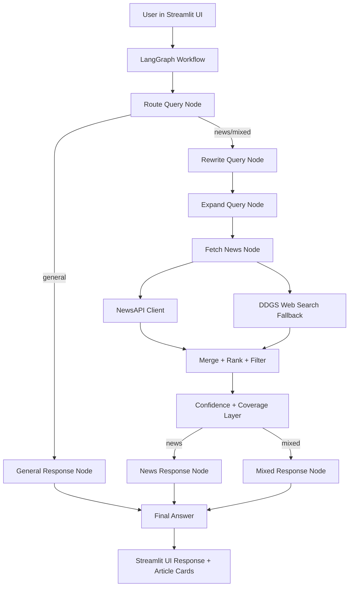
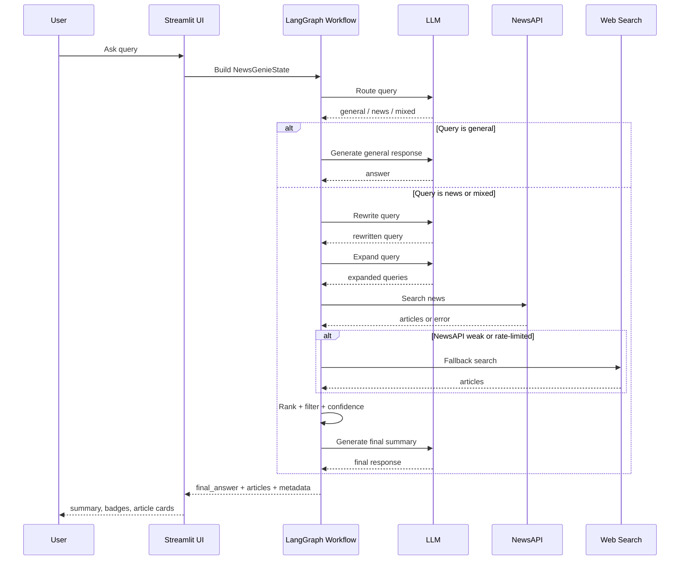

# AI_NEWS_Ginne
NewsGenie – An AI-Powered Information and News Assistant

# NewsGenie

NewsGenie is an **Agentic AI news assistant** built with **Streamlit**, **LangGraph**, **OpenAI/Gemini**, **NewsAPI**, and **web-search fallback**.

It can:
- answer general questions
- fetch and summarize the latest news
- handle mixed questions that need both explanation and live news
- rewrite vague follow-up queries using conversation context
- expand and rank searches across multiple retrieval paths
- apply entity, region, and timeframe-aware filtering
- generate confidence-aware summaries with coverage notes
- gracefully fall back when NewsAPI is rate-limited or unavailable

---

## 1. Key Features

### Core capabilities
- **General Q&A** for non-news questions
- **Live news retrieval** for current events and headlines
- **Mixed-query support** for prompts like:  
  `Explain inflation and also give me today's finance news`

### Agentic workflow
- **Routing** into `general`, `news`, or `mixed`
- **Memory-aware follow-up handling** for prompts like:  
  `what about in Europe?`  
  `and in the US?`  
  `give me more on Arsenal`
- **Query rewriting** to convert vague prompts into standalone search queries
- **Query expansion** to generate multiple search-friendly variants
- **Entity locking** for topics like `OpenAI`, `Arsenal`, `S&P 500`, `Nasdaq`
- **Timeframe detection** for `today`, `latest`, `this week`
- **Region-aware retrieval** for `US`, `Europe`, `India`, `Asia`

### Quality and trust
- **Confidence labels**: Low / Medium / High
- **Coverage notes** explaining whether the result set is broad or limited
- **Source-aware ranking and filtering**
- **Fallback behavior** when NewsAPI rate-limits or returns weak results

### UI
- Polished **Streamlit chat interface**
- **Article cards** with source, time, score, and links
- **Badges** for category, confidence, and timeframe
- **Debug panel** for rewritten query, expansions, entities, and coverage note

---

## 2. Architecture Overview

## High-level architecture diagram



---

## 3. Detailed Architecture Explanation

### 3.1 Streamlit UI Layer
The `app.py` file provides the user-facing interface.

Responsibilities:
- collect user queries through chat input
- maintain session chat history
- send state into the LangGraph workflow
- render summaries, badges, and article cards
- show optional debug information

### 3.2 LangGraph Orchestration Layer
The heart of the app is the **LangGraph state machine** in `src/graph/workflow.py`.

It manages the multi-step agentic flow:
1. **Route query**
2. **Rewrite query** if needed
3. **Expand search queries**
4. **Fetch and merge articles**
5. **Compute confidence and coverage**
6. **Generate final response**

This makes the system modular and easy to extend.

### 3.3 Routing Agent
The routing node decides whether a user query is:
- `general`
- `news`
- `mixed`

Examples:
- `Who is the CEO of Microsoft?` → `general`
- `latest AI news` → `news`
- `Explain inflation and also give me today's finance news` → `mixed`

### 3.4 Query Rewrite Agent
The rewrite node makes vague user prompts more retrieval-friendly.

Examples:
- `what about in Europe?` → `latest AI news in Europe`
- `and in the US?` → `today's US stock market news`
- `give me more on Arsenal` → `Arsenal latest Champions League news`

### 3.5 Query Expansion Agent
This node generates multiple search variations to improve recall.

Example expansions:
- original query
- rewritten standalone query
- narrow entity-specific query
- category-aware query

This improves retrieval diversity without changing user intent.

### 3.6 Retrieval Layer
The retrieval layer uses two sources:

#### Primary source: NewsAPI
Used first for:
- `everything`
- `top-headlines`

#### Fallback source: DDGS web search
Used when:
- NewsAPI is rate-limited
- NewsAPI fails
- NewsAPI returns weak coverage

### 3.7 Ranking and Filtering Layer
After retrieval, all results go through:
- de-duplication
- source normalization
- trust scoring
- region filtering
- entity locking
- timeframe-aware recency scoring
- competition and index matching
- noise filtering

This is where the system decides whether an article is truly relevant.

### 3.8 Confidence and Coverage Layer
After ranking, NewsGenie computes:
- **confidence score**
- **confidence label**
- **coverage note**

This ensures the assistant stays honest.

Examples:
- **High confidence** when several strong relevant articles are found
- **Low confidence** when only 1 weak or sparse article is found

### 3.9 Response Generation Layer
The final LLM response is generated differently based on query type:

#### General
Normal assistant response

#### News
Summary + key developments + watchouts

#### Mixed
General answer + latest news + key developments + watchouts

---

## 4. Workflow Diagram with Steps



---

## 5. Project Structure

```text
newsgenie/
├── app.py
├── README.md
├── requirements.txt
├── requirements-lock.txt
├── .env.example
├── src/
│   ├── config.py
│   ├── prompts.py
│   ├── state.py
│   ├── graph/
│   │   └── workflow.py
│   ├── models/
│   │   ├── openai_client.py
│   │   └── gemini_client.py
│   ├── tools/
│   │   ├── news_api.py
│   │   └── web_search.py
│   └── utils/
│       ├── helpers.py
│       ├── common.py
│       ├── news_helpers.py
│       ├── answer_quality.py
│       └── ui_helpers.py
└── tests/
    ├── smoke_test.py
    ├── test_routing.py
    ├── test_news_fetch.py
    ├── test_ranked_news.py
    ├── test_query_rewrite.py
    ├── test_dual_search.py
    ├── test_step7_filters.py
    ├── test_step8_quality.py
    ├── test_step9_precision.py
    ├── test_step10_entity_lock.py
    └── test_step11_resilience.py
```

---

## 6. Tech Stack

- **Python**
- **Streamlit**
- **LangGraph**
- **OpenAI Responses API**
- **Google Gemini**
- **NewsAPI**
- **DDGS** for fallback search
- **Pydantic** for state modeling
- **Requests** for API access

---

## 7. Setup Instructions

### 7.1 Create virtual environment

```bash
python -m venv newsginni
source newsginni/bin/activate
```

### 7.2 Install dependencies

```bash
pip install -r requirements.txt
```

### 7.3 Configure environment

Copy `.env.example` to `.env`.

```bash
cp .env.example .env
```

Example `.env`:

```env
OPENAI_API_KEY=your_openai_api_key_here
MODEL_PROVIDER=openai
OPENAI_MODEL=gpt-5-mini

GEMINI_API_KEY=your_gemini_api_key_here
NEWS_API_KEY=your_newsapi_key_here

APP_ENV=dev
DEBUG=false
```

---

## 8. How to Run

### Start Streamlit app

```bash
streamlit run app.py
```

### Run core tests

```bash
python -m tests.smoke_test
python -m tests.test_routing
python -m tests.test_news_fetch
python -m tests.test_step10_entity_lock
python -m tests.test_step11_resilience
```

---

## 9. Example Queries

### General queries
- `Who is the CEO of Microsoft?`
- `Explain inflation`

### News queries
- `latest AI news in Europe`
- `today's S&P 500 and Nasdaq news`
- `latest Arsenal Champions League news`

### Mixed queries
- `Explain inflation and also give me today's finance news`

### Follow-up queries
- `what about in Europe?`
- `and in the US?`
- `give me more on Arsenal`

---

## 10. Final Validation Checklist

### Core functionality
- [x] App starts successfully
- [x] OpenAI integration works
- [x] Streamlit UI works
- [x] LangGraph workflow runs end to end
- [x] Router classifies `general`, `news`, `mixed`
- [x] Query rewrite works
- [x] Query expansion works
- [x] Retrieval works
- [x] Ranking/filtering works
- [x] Confidence and coverage notes work
- [x] NewsAPI fallback to web search works
- [x] Entity/timeframe logic works
- [x] UI shows badges/cards/debug details

### Robustness
- [x] Safer JSON parsing
- [x] Retry logic exists
- [x] Rate-limit fallback works
- [x] Empty/weak coverage handled honestly

### Known acceptable limitations
- [x] NewsAPI free-tier rate limits can occur
- [x] Fallback search quality depends on public web results
- [x] Some niche entity + region combinations may have limited coverage

---

## 11. Known Limitations

- **NewsAPI free tier** can hit rate limits quickly during repeated test runs.
- **Public search fallback** depends on the quality and freshness of search engine results.
- Some combinations like **entity + region + timeframe** may still yield sparse coverage.
- Confidence depends on:
  - article availability
  - source quality
  - relevance of retrieved articles

---

## 12. Submission / Demo Status

NewsGenie is now a **demo-ready advanced prototype** with:
- agentic orchestration
- robust retrieval fallback
- confidence-aware summarization
- entity / region / timeframe-aware filtering
- polished Streamlit UI

### Current completion status
- **Core implementation:** complete
- **Robustness:** good
- **UI polish:** complete for demo
- **Packaging:** complete with README and `.env.example`

---

## 13. Future Improvements

Optional future enhancements:
- response caching to reduce repeated API calls
- export chat / save summaries
- region selector in UI
- persistent chat memory/database
- Docker deployment
- Streamlit Cloud / Render deployment
- analytics and evaluation dashboard

---

## 14. Quick Pitch

**NewsGenie** is an agentic AI news assistant that understands vague follow-up questions, rewrites them into precise retrieval queries, gathers live coverage from multiple sources, filters and ranks results by relevance, and returns confidence-aware summaries in a polished Streamlit interface.

# NewsGenie Architecture

# NewsGenie

NewsGenie is an **Agentic AI news assistant** built with **Streamlit**, **LangGraph**, **OpenAI/Gemini**, **NewsAPI**, and **web-search fallback**.

It can:
- answer general questions
- fetch and summarize the latest news
- handle mixed questions that need both explanation and live news
- rewrite vague follow-up queries using conversation context
- expand and rank searches across multiple retrieval paths
- apply entity, region, and timeframe-aware filtering
- generate confidence-aware summaries with coverage notes
- gracefully fall back when NewsAPI is rate-limited or unavailable

---

## 1. Key Features

### Core capabilities
- **General Q&A** for non-news questions
- **Live news retrieval** for current events and headlines
- **Mixed-query support** for prompts like:  
  `Explain inflation and also give me today's finance news`

### Agentic workflow
- **Routing** into `general`, `news`, or `mixed`
- **Memory-aware follow-up handling** for prompts like:  
  `what about in Europe?`  
  `and in the US?`  
  `give me more on Arsenal`
- **Query rewriting** to convert vague prompts into standalone search queries
- **Query expansion** to generate multiple search-friendly variants
- **Entity locking** for topics like `OpenAI`, `Arsenal`, `S&P 500`, `Nasdaq`
- **Timeframe detection** for `today`, `latest`, `this week`
- **Region-aware retrieval** for `US`, `Europe`, `India`, `Asia`

### Quality and trust
- **Confidence labels**: Low / Medium / High
- **Coverage notes** explaining whether the result set is broad or limited
- **Source-aware ranking and filtering**
- **Fallback behavior** when NewsAPI rate-limits or returns weak results

### UI
- Polished **Streamlit chat interface**
- **Article cards** with source, time, score, and links
- **Badges** for category, confidence, and timeframe
- **Debug panel** for rewritten query, expansions, entities, and coverage note

---

## 2. Architecture Overview

## High-level architecture diagram


---

## 3. Detailed Architecture Explanation

### 3.1 Streamlit UI Layer
The `app.py` file provides the user-facing interface.

Responsibilities:
- collect user queries through chat input
- maintain session chat history
- send state into the LangGraph workflow
- render summaries, badges, and article cards
- show optional debug information

### 3.2 LangGraph Orchestration Layer
The heart of the app is the **LangGraph state machine** in `src/graph/workflow.py`.

It manages the multi-step agentic flow:
1. **Route query**
2. **Rewrite query** if needed
3. **Expand search queries**
4. **Fetch and merge articles**
5. **Compute confidence and coverage**
6. **Generate final response**

This makes the system modular and easy to extend.

### 3.3 Routing Agent
The routing node decides whether a user query is:
- `general`
- `news`
- `mixed`

Examples:
- `Who is the CEO of Microsoft?` → `general`
- `latest AI news` → `news`
- `Explain inflation and also give me today's finance news` → `mixed`

### 3.4 Query Rewrite Agent
The rewrite node makes vague user prompts more retrieval-friendly.

Examples:
- `what about in Europe?` → `latest AI news in Europe`
- `and in the US?` → `today's US stock market news`
- `give me more on Arsenal` → `Arsenal latest Champions League news`

### 3.5 Query Expansion Agent
This node generates multiple search variations to improve recall.

Example expansions:
- original query
- rewritten standalone query
- narrow entity-specific query
- category-aware query

This improves retrieval diversity without changing user intent.

### 3.6 Retrieval Layer
The retrieval layer uses two sources:

#### Primary source: NewsAPI
Used first for:
- `everything`
- `top-headlines`

#### Fallback source: DDGS web search
Used when:
- NewsAPI is rate-limited
- NewsAPI fails
- NewsAPI returns weak coverage

### 3.7 Ranking and Filtering Layer
After retrieval, all results go through:
- de-duplication
- source normalization
- trust scoring
- region filtering
- entity locking
- timeframe-aware recency scoring
- competition and index matching
- noise filtering

This is where the system decides whether an article is truly relevant.

### 3.8 Confidence and Coverage Layer
After ranking, NewsGenie computes:
- **confidence score**
- **confidence label**
- **coverage note**

This ensures the assistant stays honest.

Examples:
- **High confidence** when several strong relevant articles are found
- **Low confidence** when only 1 weak or sparse article is found

### 3.9 Response Generation Layer
The final LLM response is generated differently based on query type:

#### General
Normal assistant response

#### News
Summary + key developments + watchouts

#### Mixed
General answer + latest news + key developments + watchouts

---

## 4. Workflow Diagram with Steps


---

## 5. Project Structure

```text
newsgenie/
├── app.py
├── README.md
├── requirements.txt
├── requirements-lock.txt
├── .env.example
├── src/
│   ├── config.py
│   ├── prompts.py
│   ├── state.py
│   ├── graph/
│   │   └── workflow.py
│   ├── models/
│   │   ├── openai_client.py
│   │   └── gemini_client.py
│   ├── tools/
│   │   ├── news_api.py
│   │   └── web_search.py
│   └── utils/
│       ├── helpers.py
│       ├── common.py
│       ├── news_helpers.py
│       ├── answer_quality.py
│       └── ui_helpers.py
└── tests/
    ├── smoke_test.py
    ├── test_routing.py
    ├── test_news_fetch.py
    ├── test_ranked_news.py
    ├── test_query_rewrite.py
    ├── test_dual_search.py
    ├── test_step7_filters.py
    ├── test_step8_quality.py
    ├── test_step9_precision.py
    ├── test_step10_entity_lock.py
    └── test_step11_resilience.py
```

---

## 6. Tech Stack

- **Python**
- **Streamlit**
- **LangGraph**
- **OpenAI Responses API**
- **Google Gemini**
- **NewsAPI**
- **DDGS** for fallback search
- **Pydantic** for state modeling
- **Requests** for API access

---

## 7. Setup Instructions

### 7.1 Create virtual environment

```bash
python -m venv newsginni
source newsginni/bin/activate
```

### 7.2 Install dependencies

```bash
pip install -r requirements.txt
```

### 7.3 Configure environment

Copy `.env.example` to `.env`.

```bash
cp .env.example .env
```

Example `.env`:

```env
OPENAI_API_KEY=your_openai_api_key_here
MODEL_PROVIDER=openai
OPENAI_MODEL=gpt-5-mini

GEMINI_API_KEY=your_gemini_api_key_here
NEWS_API_KEY=your_newsapi_key_here

APP_ENV=dev
DEBUG=false
```

---

## 8. How to Run

### Start Streamlit app

```bash
streamlit run app.py
```

### Run core tests

```bash
python -m tests.smoke_test
python -m tests.test_routing
python -m tests.test_news_fetch
python -m tests.test_step10_entity_lock
python -m tests.test_step11_resilience
```

---

## 9. Example Queries

### General queries
- `Who is the CEO of Microsoft?`
- `Explain inflation`

### News queries
- `latest AI news in Europe`
- `today's S&P 500 and Nasdaq news`
- `latest Arsenal Champions League news`

### Mixed queries
- `Explain inflation and also give me today's finance news`

### Follow-up queries
- `what about in Europe?`
- `and in the US?`
- `give me more on Arsenal`

---

## 10. Final Validation Checklist

### Core functionality
- [x] App starts successfully
- [x] OpenAI integration works
- [x] Streamlit UI works
- [x] LangGraph workflow runs end to end
- [x] Router classifies `general`, `news`, `mixed`
- [x] Query rewrite works
- [x] Query expansion works
- [x] Retrieval works
- [x] Ranking/filtering works
- [x] Confidence and coverage notes work
- [x] NewsAPI fallback to web search works
- [x] Entity/timeframe logic works
- [x] UI shows badges/cards/debug details

### Robustness
- [x] Safer JSON parsing
- [x] Retry logic exists
- [x] Rate-limit fallback works
- [x] Empty/weak coverage handled honestly

### Known acceptable limitations
- [x] NewsAPI free-tier rate limits can occur
- [x] Fallback search quality depends on public web results
- [x] Some niche entity + region combinations may have limited coverage

---

## 11. Known Limitations

- **NewsAPI free tier** can hit rate limits quickly during repeated test runs.
- **Public search fallback** depends on the quality and freshness of search engine results.
- Some combinations like **entity + region + timeframe** may still yield sparse coverage.
- Confidence depends on:
  - article availability
  - source quality
  - relevance of retrieved articles

---

## 12. Submission / Demo Status

NewsGenie is now a **demo-ready advanced prototype** with:
- agentic orchestration
- robust retrieval fallback
- confidence-aware summarization
- entity / region / timeframe-aware filtering
- polished Streamlit UI

### Current completion status
- **Core implementation:** complete
- **Robustness:** good
- **UI polish:** complete for demo
- **Packaging:** complete with README and `.env.example`

---

## 13. Future Improvements

Optional future enhancements:
- response caching to reduce repeated API calls
- export chat / save summaries
- region selector in UI
- persistent chat memory/database
- Docker deployment
- Streamlit Cloud / Render deployment
- analytics and evaluation dashboard

---

## 14. Quick Pitch

**NewsGenie** is an agentic AI news assistant that understands vague follow-up questions, rewrites them into precise retrieval queries, gathers live coverage from multiple sources, filters and ranks results by relevance, and returns confidence-aware summaries in a polished Streamlit interface.
